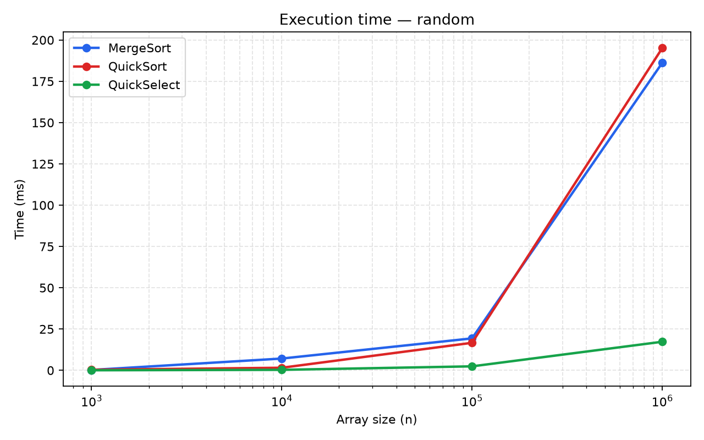
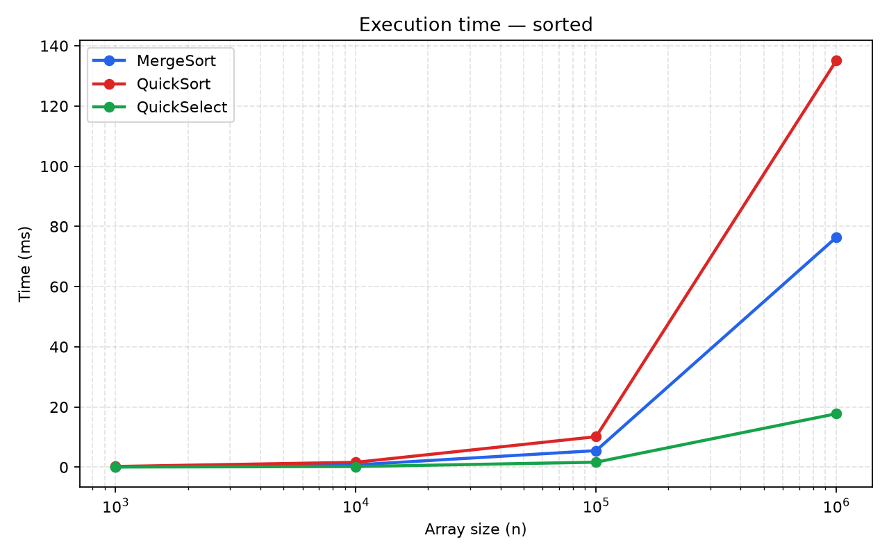
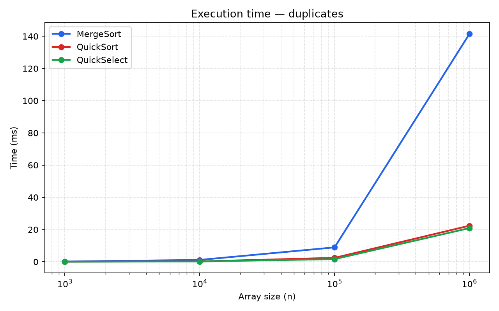
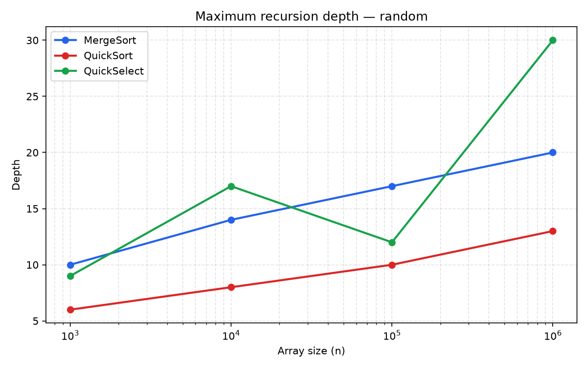
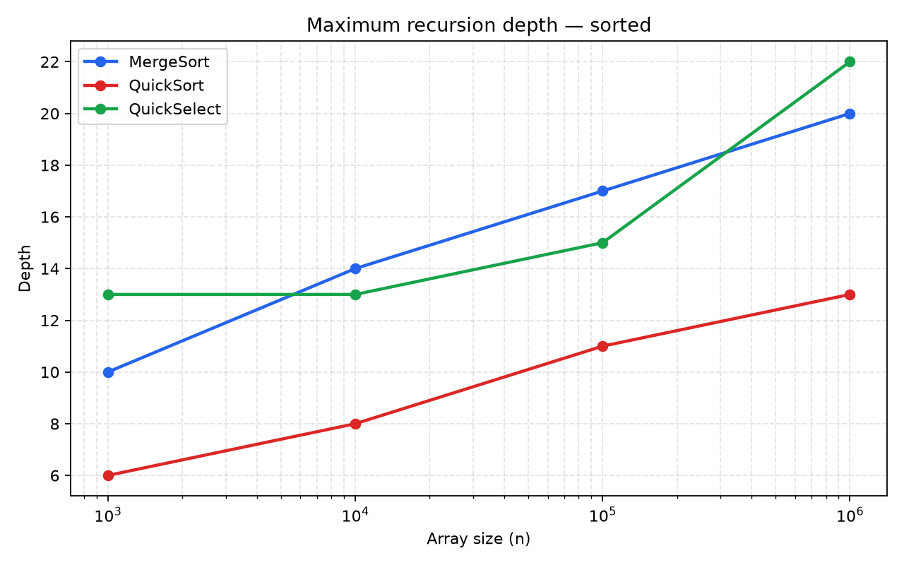
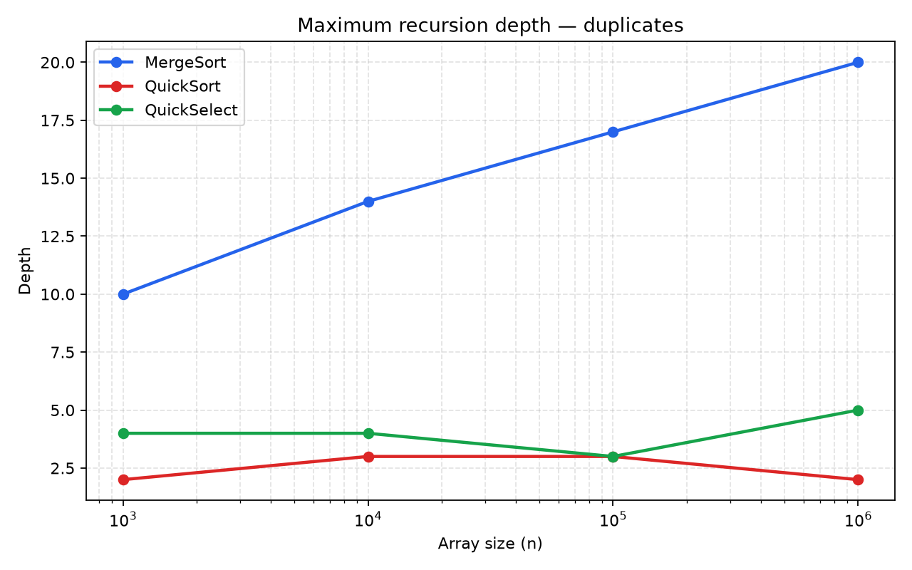
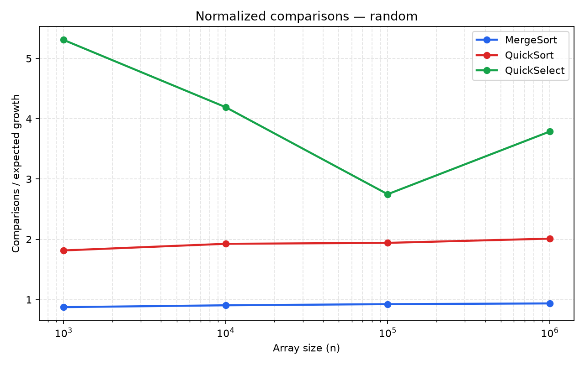
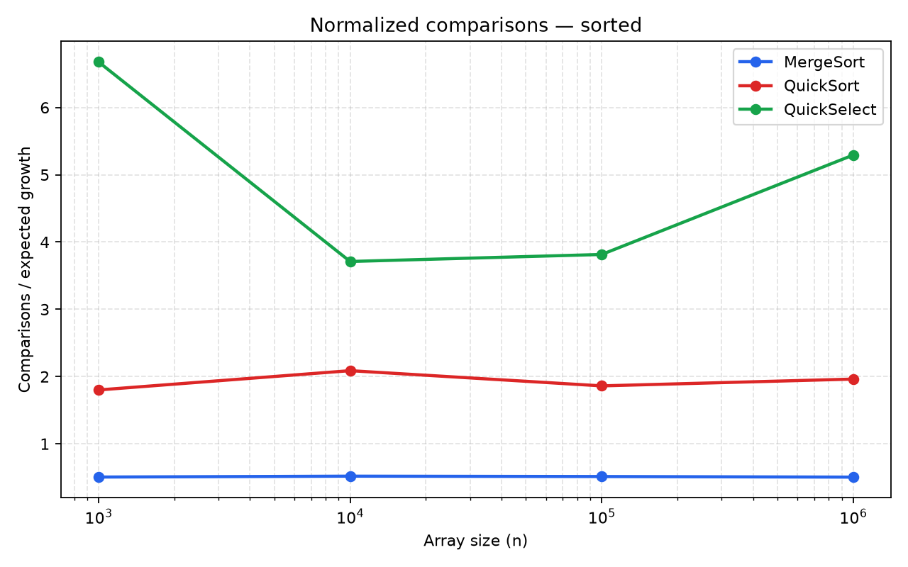
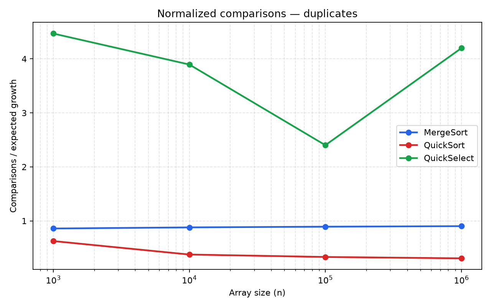

# Assignment 1

## Algorithm complexity

| Algorithm | Best case | Average case | Worst case |
|---|---|---|---|
| MergeSort | Θ(n log n) — merging at every level | Θ(n log n) — every input is split and merged | Θ(n log n) — split depth and merge work stay the same |
| QuickSort | Θ(n log n) — balanced partitions | Θ(n log n) expected — random pivots usually give balanced partitions | O(n²) — repeatedly very uneven partitions |
| QuickSelect | Ω(n) — must inspect the input in the best case | Θ(n) expected — each partition discards a substantial part on average | O(n²) — repeatedly keeps almost the whole range |
| Insertion Sort | Ω(n) — already sorted input still needs one pass | Θ(n²) — typical unsorted input shifts many elements | Θ(n²) — reverse-sorted input causes the most shifts |

## Code structure

| Path | Contents |
|---|---|
| `Sorts/` | MergeSort, QuickSort, Insertion Sort |
| `Selects/` | QuickSelect |
| `Benchmarks/` | Benchmark runner and metrics |
| `Utils/` | Array helper methods |
| `Tables/` | Python scripts for table and plot generation |
| `Results/` | CSV data, Markdown table, and plots |

## Run

### Option 1: Run from the project folder

Open a console in the project root and compile:

```bash
mkdir -p out
javac -d out Main.java Benchmarks/*.java Sorts/*.java Selects/*.java Utils/*.java
```

Run the benchmark:

```bash
java -cp out Benchmarks.Benchmark
```

### Option 2: Clone from GitHub

Clone the repository and enter the project folder:

```bash
git clone https://github.com/SaveXanthous/DAA-Assignment-1.git
cd DAA-Assignment-1
```

Then compile and run the benchmark:

```bash
mkdir -p out
javac -d out Main.java Benchmarks/*.java Sorts/*.java Selects/*.java Utils/*.java
java -cp out Benchmarks.Benchmark
```

Generate the result table and plots from the project root:

```bash
python3 Tables/table_results.py
python3 Tables/plot_results.py
```

The plot scripts require Python 3 and Matplotlib.

## Results

### Runtime

| Random | Sorted | Duplicates |
|---|---|---|
|  |  |  |

### Maximum depth

| Random | Sorted | Duplicates |
|---|---|---|
|  |  |  |

### Normalized comparisons

| Random | Sorted | Duplicates |
|---|---|---|
|  |  |  |
